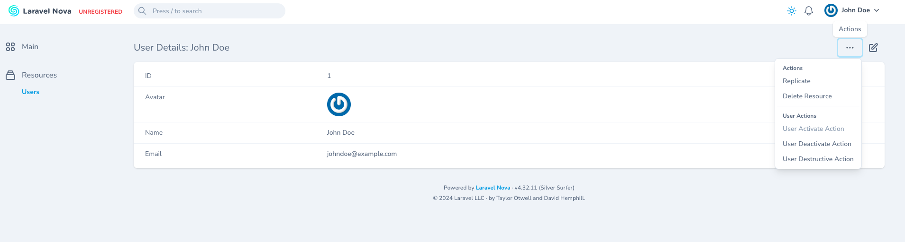

# Nova Application Setup Guide

This guide provides instructions on setting up the Nova application, creating a new user, and outlines a current issue within the Nova User Resource.


## Setup Instructions

1. **Clone the Repository:**

```
git clone git@github.com:jbumaniss/nova-app.git
```

2. **Navigate to the nova-app directory:**

```
cd nova-app
```

3. **Install Composer Dependencies:**

```
composer install
```

4. **Set Up Environment File:**

```
cp .env.example .env
```

5. **Generate an App Encryption Key:**

```
php artisan key:generate
```

6. **Start Laravel Sail:**

```
./vendor/bin/sail up -d
```

## Create new user

1. **Enter Tinker Environment:**

```
./vendor/bin/sail artisan tinker
```

2. **Create a new user:**

```
$user = new \App\Models\User();
$user->name = “John Doe”;
$user->email = "johndoe@example.com";
$user->password = Hash::make('password');
$user->save();
```

### Login Information

- URL = http://localhost/nova

- Username: johndoes@example.com

- Password: password

### Issue in Nova User Resource

#### Description
Within the Nova User Resource, three actions have been created. Each action's canRun() method is set to return false, implying that all actions should be disabled in the UI.

#### Observed behavior
- Only the first action is disabled, as expected
- The other two actions remain enabled
- If the first action is commented out, the second one gets disabled, but third remains enabled

#### Expected behavior
All 3 actions should be disabled in the UI if their canRun() method returns false

### Additional Observation
It has been noted that in the list view, all three actions are correctly hidden, aligning with the expected behavior. However, it's important to highlight a potential inconsistency: according to the latest Nova guidelines, actions that are not permitted should ideally be shown in a disabled state rather than being hidden. This distinction is crucial for maintaining a consistent and intuitive user interface. We kindly suggest revisiting this aspect to ensure alignment with Nova's best practices.

